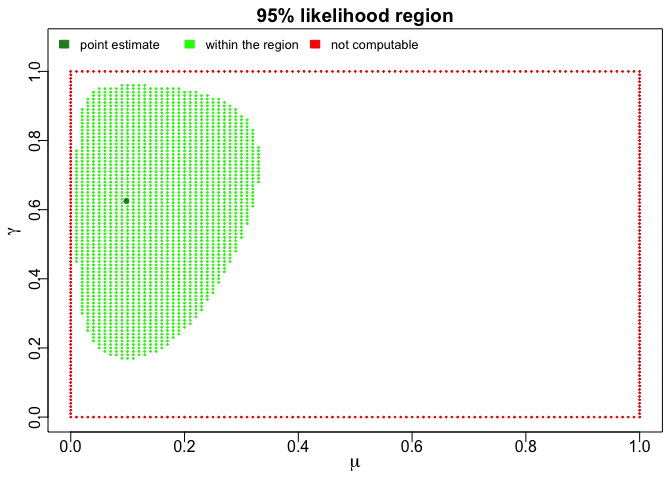
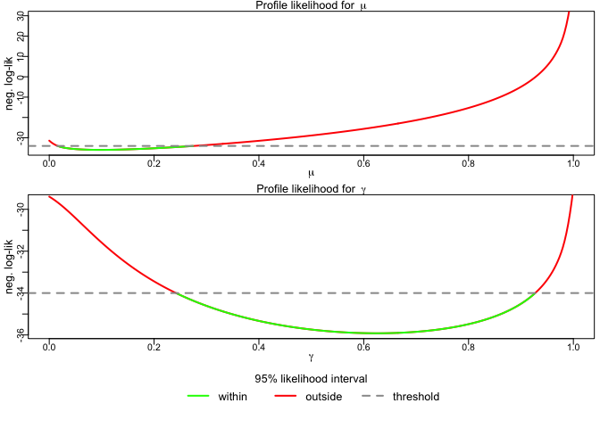

"clever-source" code from sensR package:

```r
# library(devtools)
# pkgpath <- "~/GitHub/sensR/sensR"
# load_all(pkgpath)

# Alternatively use:
# install.packages("devtools")
# devtools::install_github("runehaubo/sensR", ref="cbb-profile")
library(sensR)
```

## section 6.2.2 optimcbb


```r
# p 48:
y <- rep(4,12) #set of responses
n <- 12 #number of assessors
k <- 4 #number of replications
p0 <- 1/3 #guessing probability
#unfortunate initial values
optim(par = c(0.5, 0.5), fn = loglikcbb, y = y, k = k, p0 = p0)
```

```
## $par
## [1] 1.0000000 0.6673296
## 
## $value
## [1] -14.59675
## 
## $counts
## function gradient 
##      335       NA 
## 
## $convergence
## [1] 10
## 
## $message
## NULL
```

```r
#other initial values
optim(par = c(0.4, 0.4), fn = loglikcbb, y = y, k = k, p0 = p0)
```

```
## $par
## [1] 1.0000000 0.5486495
## 
## $value
## [1] -14.59674
## 
## $counts
## function gradient 
##      169       NA 
## 
## $convergence
## [1] 0
## 
## $message
## NULL
```


```r
# p49:
#invalid initial values
optimcbb(y, k, p0, init = c(1,0))
```

```
## Both initial values have to satisfy 0 < initial_value < 1.
##             
## Changing to default: (0.5,0.2)
```

```
## $mu
## [1] 1
## 
## $gamma
## [1] 0.3357867
## 
## $neg.loglik
## [1] -14.59675
## 
## $conv
## [1] TRUE
```

```r
#unfortunate initial values
optimcbb(y, k, p0, init = c(0.5,0.5))
```

```
## A convergence problem or an error occurred.
##                     
## Changing initial values to randomly generated: (0.364158501353097, 0.906065111495619)
```

```
## $mu
## [1] 0.9999999
## 
## $gamma
## [1] 0.9527343
## 
## $neg.loglik
## [1] -14.59674
## 
## $conv
## [1] TRUE
```

## section 6.2.3 plotcbb


```r
# p50
y1 <- c(2,2,3,3,4,4,4,4,4,4,4,5,6,10,11) #set of responses 
k1 <- 12 #number of replications
p0 <- 1/3 #guessing probability
#plot the likelihood region
(example1 <- plotcbb(y1, k1, p0))
```

<!-- -->

```
## $mu
## [1] 0.09780216
## 
## $gamma
## [1] 0.6252464
## 
## $neg.loglik
## [1] -35.92001
## 
## $loglik.bound
## [1] -32.92428
```

```r
#check if the point is inside of the likelihood region
loglikcbb(c(0.12, 0.46), y1, k1, p0) < example1$loglik.bound
```

```
## [1] TRUE
```

```r
#check if the point is inside of the likelihood region
loglikcbb(c(0.12, 0.12), y1, k1, p0) < example1$loglik.bound
```

```
## [1] FALSE
```

## section 6.2.4 profilecbb


```r
# p52
y1 <- c(2,2,3,3,4,4,4,4,4,4,4,5,6,10,11) #set of responses 
k1 <- 12 #number of replication
p0 <- 1/3 #guessing probability
#plot profile likelihood
profilecbb(y1, k1, p0)
```

<!-- -->

```
## $mu_lower
## [1] 0.01619222
## 
## $mu_upper
## [1] 0.2755587
## 
## $gamma_lower
## [1] 0.241949
## 
## $gamma_upper
## [1] 0.9270952
```

## Session info

Session Info for potential debug'ing:

```r
sessionInfo()
```

```
## R version 3.5.0 (2018-04-23)
## Platform: x86_64-apple-darwin15.6.0 (64-bit)
## Running under: OS X El Capitan 10.11.6
## 
## Matrix products: default
## BLAS: /Library/Frameworks/R.framework/Versions/3.5/Resources/lib/libRblas.0.dylib
## LAPACK: /Library/Frameworks/R.framework/Versions/3.5/Resources/lib/libRlapack.dylib
## 
## locale:
## [1] en_US.UTF-8/en_US.UTF-8/en_US.UTF-8/C/en_US.UTF-8/en_US.UTF-8
## 
## attached base packages:
## [1] stats     graphics  grDevices utils     datasets  methods   base     
## 
## other attached packages:
## [1] sensR_1.5-1.9001
## 
## loaded via a namespace (and not attached):
##  [1] Rcpp_0.12.16      knitr_1.20        magrittr_1.5     
##  [4] splines_3.5.0     MASS_7.3-49       lattice_0.20-35  
##  [7] multcomp_1.4-8    stringr_1.2.0     tools_3.5.0      
## [10] grid_3.5.0        TH.data_1.0-8     htmltools_0.3.6  
## [13] yaml_2.1.18       survival_2.41-3   rprojroot_1.3-2  
## [16] digest_0.6.12     numDeriv_2016.8-1 Matrix_1.2-14    
## [19] codetools_0.2-15  evaluate_0.10.1   rmarkdown_1.9    
## [22] sandwich_2.4-0    stringi_1.1.5     compiler_3.5.0   
## [25] backports_1.1.1   mvtnorm_1.0-7     zoo_1.8-1
```

