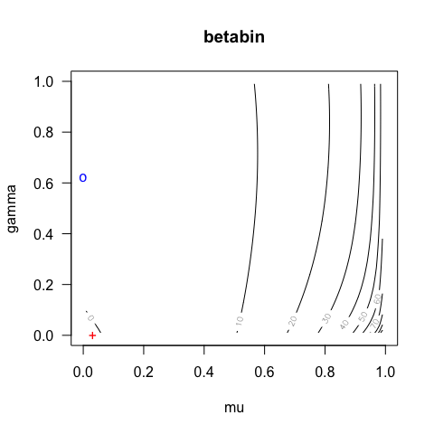
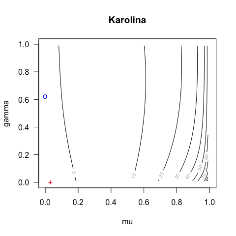
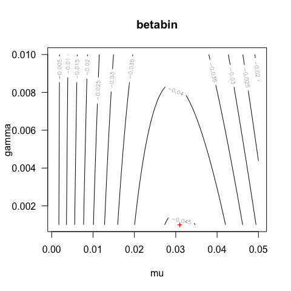
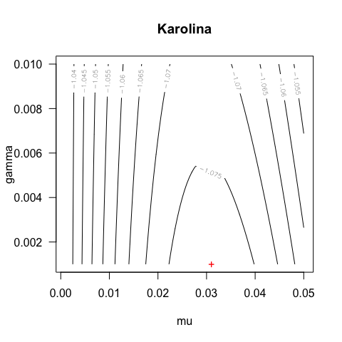
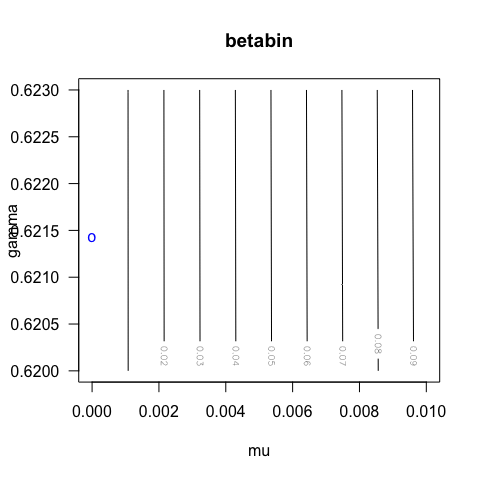
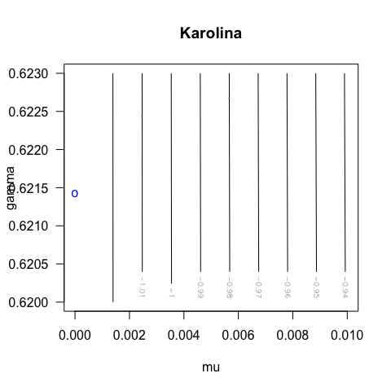

While tweaking Karolina's code to make it run, I noticed that Karolina's `optimcbb` and `betabin` didn't give the same answers on the first set of simulated data, so I thought I'd look a bit more.

First, gain access to Karolina's functions:

```r
# library(devtools)
# pkgpath <- "~/GitHub/sensR/sensR" # Adjust path to YOUR location
# load_all(pkgpath)

# Alternatively use:
# install.packages("devtools")
# devtools::install_github("runehaubo/sensR", ref="cbb-profile")
library(sensR)
```

Get parameters for the datasets considered in chapter 7 in the thesis:

```r
para <- data.frame( a = rep(c(0.3,1,3,2,4), 8),
                    b = rep(c(2.7,2,6,2,0.5), 8),
                    p0 = c(rep(1/3, 20), rep(1/2, 20)),
                    n = c(rep( c(rep(12, 5), rep(18, 5), rep(30, 5), rep(100, 5)), 2)),
                    k = c(rep( c(rep(4, 5), rep(12, 5), rep(10, 5), rep(3, 5)), 2)) )
```

Here the first parameter set reads:

```r
# get parameters
j <- 1
a <- para$a[j]
b <- para$b[j]
p0 <- para$p0[j]
n <- para$n[j]
k <- para$k[j]
mu <- a/(a+b)
gamma <- 1/(a+b+1)

c(a=a, b=b, p0=p0, n=n, k=k, mu=mu, gamma=gamma)
```

```
##          a          b         p0          n          k         mu 
##  0.3000000  2.7000000  0.3333333 12.0000000  4.0000000  0.1000000 
##      gamma 
##  0.2500000
```

Simulations are done with the following seed:

```r
# simulate responses:
set.seed(123)
sim_pd <- rbeta(n, a, b)
sim_pc <- p0 + (1-p0) * sim_pd
y <- rbinom(n = rep(1, n), size = rep(k, n), prob = sim_pc)
response <- cbind(y, rep(k, n))
```

Fit the model using Karolina's `optimcbb` as well as `betabin`: 

```r
(fm_karo <- optimcbb(y, k, p0))
```

```
## $mu
## [1] 1.610385e-09
## 
## $gamma
## [1] 0.6214232
## 
## $neg.loglik
## [1] -1.032945
## 
## $conv
## [1] TRUE
```

```r
fm1 <- betabin(response, method="threeAFC", corrected = TRUE)
```

```
## Warning: Parameters at boundary occurred
```

```r
summary(fm1) # different from fm_karo
```

```
## 
## Chance-corrected beta-binomial model for the threeAFC protocol
## with 95 percent confidence intervals
## 
##         Estimate Std. Error Lower Upper
## mu       0.03101         NA    NA    NA
## gamma    0.00100         NA    NA    NA
## pc       0.35400         NA    NA    NA
## pd       0.03101         NA    NA    NA
## d-prime  0.07245         NA    NA    NA
## 
## log-likelihood:  -13.5182 
## LR-test of over-dispersion, G^2: -0.0016 df: 1 p-value: 1 
## LR-test of association, G^2: 0.0913 df: 2 p-value: 0.9554
```

Note that the value of the log-likelihood as well as the parameters are different. The difference in the log-likelihood value could very well just be because she has left out a constant term, but the difference in the parameter values is more serious.

We can look at the contours of the likelihood function as it is implemented in `sensR::betabin` and Karolina's `loglikcbb`:

```r
fm_env <- update(fm1, doFit=FALSE) # get model environment
# Display contours of the likelihood surface:
# Compute the negative log-lik at grid of values for mu and gamma:
muvec <- gammavec <- seq(0.01, .99, .01)
pardf <- expand.grid(mu=muvec, gamma=gammavec)
# head(pardf)
# str(pardf)

# implementation in sensR:
nllvec <- sapply(1:nrow(pardf), function(i) 
  sensR:::setParBB(fm_env, par=as.vector(unlist(pardf[i, ]))))
Z <- matrix(nllvec, ncol=length(gammavec))
# Plot the likelihood contours:
contour(muvec, gammavec, Z, xlim=c(0, 1), ylim=c(0, 1), ylab="gamma", xlab="mu", 
        main="betabin", las=1)
points(x=coef(fm1)[1], y=coef(fm1)[2], pch="+", col="red")
points(x=fm_karo[["mu"]], y=fm_karo[["gamma"]], pch="o", col="blue")

# Karolina's implementation:
nllvec <- sapply(1:nrow(pardf), function(i) 
  loglikcbb(as.vector(unlist(pardf[i, ])), y, k, p0))
Z <- matrix(nllvec, ncol=length(gammavec))
# Plot the likelihood contours:
contour(muvec, gammavec, Z, xlim=c(0, 1), ylim=c(0, 1), ylab="gamma", xlab="mu", 
        main="Karolina", las=1)
points(x=coef(fm1)[1], y=coef(fm1)[2], pch="+", col="red")
points(x=fm_karo[["mu"]], y=fm_karo[["gamma"]], pch="o", col="blue")
```



These contours seem to have an overall similar shape. The red cross is the estimate from `betabin` and the blue circle is the estimate from `optimcbb`.

As described in `help(betabin)` the functions `setParBB` and `getParBB` can be used to compute on the likelihood for a particular setting using the model environment returned by use of the `doFit=FALSE` argument.

We can now close in and look at the shapes of the likelihood functions in the two implementations around the two estimates:

```r
# Closing in: 
muvec <- seq(0.001, 0.05, length.out = 101)
gammavec <- seq(0.001, 0.01, length.out = 101)
pardf <- expand.grid(mu=muvec, gamma=gammavec)
nllvec <- sapply(1:nrow(pardf), function(i) {
  sensR:::setParBB(fm_env, par=as.vector(unlist(pardf[i, ])))
})
Z <- matrix(nllvec, ncol=length(gammavec))
contour(muvec, gammavec, Z, ylab="gamma", xlab="mu", main="betabin", las=1)
points(x=coef(fm1)[1], y=coef(fm1)[2], pch="+", col="red")
points(x=fm_karo[["mu"]], y=fm_karo[["gamma"]], pch="o", col="blue")

# Karolina's implementation:
nllvec <- sapply(1:nrow(pardf), function(i) 
  loglikcbb(as.vector(unlist(pardf[i, ])), y, k, p0))
Z <- matrix(nllvec, ncol=length(gammavec))
# Plot the likelihood contours:
contour(muvec, gammavec, Z, ylab="gamma", xlab="mu", 
        main="Karolina", las=1)
points(x=coef(fm1)[1], y=coef(fm1)[2], pch="+", col="red")
points(x=fm_karo[["mu"]], y=fm_karo[["gamma"]], pch="o", col="blue")

# Closing in on the optimcbb estimate:
muvec <- seq(0.001, 0.01, length.out = 101)
gammavec <- seq(0.62, 0.623, length.out = 101)
pardf <- expand.grid(mu=muvec, gamma=gammavec)
nllvec <- sapply(1:nrow(pardf), function(i) {
  sensR:::setParBB(fm_env, par=as.vector(unlist(pardf[i, ])))
})
Z <- matrix(nllvec, ncol=length(gammavec))
contour(muvec, gammavec, Z, ylab="gamma", xlab="mu", main="betabin", las=1,
        xlim=c(0, .01))
points(x=coef(fm1)[1], y=coef(fm1)[2], pch="+", col="red")
points(x=fm_karo[["mu"]], y=fm_karo[["gamma"]], pch="o", col="blue")

# Karolina's implementation:
nllvec <- sapply(1:nrow(pardf), function(i) 
  loglikcbb(as.vector(unlist(pardf[i, ])), y, k, p0))
Z <- matrix(nllvec, ncol=length(gammavec))
# Plot the likelihood contours:
contour(muvec, gammavec, Z, ylab="gamma", xlab="mu", 
        main="Karolina", las=1, xlim=c(0, .01))
points(x=coef(fm1)[1], y=coef(fm1)[2], pch="+", col="red")
points(x=fm_karo[["mu"]], y=fm_karo[["gamma"]], pch="o", col="blue")
```



This confirms that:

1. the estimate for `optimcbb` is wrong
1. the two likelihood functions/implementations appear to have the same optimum
1. `betabin` is successfull in locating the optimum. 

At this point I'm not too confident in the results in Karolina's thesis - at least not when it comes to the simulations in chapter 7. We should probably re-run the simulations an pay close attention to the convergence properties of the model fits.

I'd be more inclined to base profile likelihood intervals on the existing implementation in sensR but maybe that also needs to be scrutinized before we use it for simulations...

<!-- A similar exercise could be performed using `optimcbb` to confirm if it is the optimization that is faulty or if there are genuine differences in the implementation of the likelihood function for the chance-corrected beta-binomial model. -->

Session Info for potential debug'ing:

```r
sessionInfo()
```

```
## R version 3.5.0 (2018-04-23)
## Platform: x86_64-apple-darwin15.6.0 (64-bit)
## Running under: OS X El Capitan 10.11.6
## 
## Matrix products: default
## BLAS: /Library/Frameworks/R.framework/Versions/3.5/Resources/lib/libRblas.0.dylib
## LAPACK: /Library/Frameworks/R.framework/Versions/3.5/Resources/lib/libRlapack.dylib
## 
## locale:
## [1] en_US.UTF-8/en_US.UTF-8/en_US.UTF-8/C/en_US.UTF-8/en_US.UTF-8
## 
## attached base packages:
## [1] stats     graphics  grDevices utils     datasets  methods   base     
## 
## other attached packages:
## [1] sensR_1.5-1.9001
## 
## loaded via a namespace (and not attached):
##  [1] Rcpp_0.12.16      knitr_1.20        magrittr_1.5     
##  [4] splines_3.5.0     MASS_7.3-49       lattice_0.20-35  
##  [7] multcomp_1.4-8    stringr_1.2.0     tools_3.5.0      
## [10] grid_3.5.0        TH.data_1.0-8     htmltools_0.3.6  
## [13] yaml_2.1.18       survival_2.41-3   rprojroot_1.3-2  
## [16] digest_0.6.12     numDeriv_2016.8-1 Matrix_1.2-14    
## [19] codetools_0.2-15  evaluate_0.10.1   rmarkdown_1.9    
## [22] sandwich_2.4-0    stringi_1.1.5     compiler_3.5.0   
## [25] backports_1.1.1   mvtnorm_1.0-7     zoo_1.8-1
```

